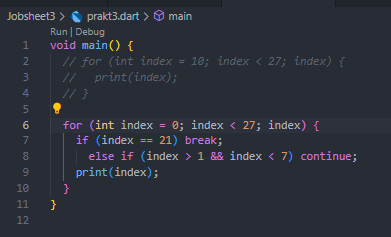

# PEMROGRAMAN MOBILE - PERTEMUAN 3

NIM : 2241720029

NAMA : SHASIA SASA SALSABYLA

## Praktikum 1 : Menerapkan Control Flows ("if/else")

### Langkah 1:

### Langkah 2:

Mendefinisikan variabel test dengan nilai test2. Menggunakan if-else untuk membandingkan nilai variabel test1 yaitu "Test1" dan test2 yaitu "Test2", jika tidak ada kondisi yang sesuai maka output "Something else".

Untuk kode "if (test == "test2") print("Test2 again");" merupakan bentuk ringkas if tanpa {}, jika kondisi test == "test2" maka outputnya "Test2 again".

### Langkah 3:

Menggunakan string karena nilainya berupa teks/string, memeriksa nilai variabel test adalah "true", jika benar maka outputnya "Kebenaran".

## Praktikum 2

### Langkah 1:

### Langkah 2:

Menggunakan while untuk melakukan perulangan dengan kondisi counter kurang dari 33 ("counter < 33"). Akan melakukan pengulangan sampai kondisi menjadi false dan perulangan berhenti.

### Langkah 3:

Menjalankan perulangan selama counter < 77. Setelah counter mencapai 77, perulangan berhenti. do-while untuk perulangan, menjalankan kode di dalam do, kemudian memeriksa while.

## Praktikum 3

### Langkah 1:

### Langkah 2:

for digunakan untuk perulangan iterasi, jika index diinialisasi ke 10 dan tidak ada increment, perulangan akan terus mengeluarkan output 10 tanpa henti, menyebabkan infinite loop.

### Langkah 3:

Perulangan index sampai index < 27. Jika kondisi index = 21, perulangan akan berhenti. Jika kondisi index antara 2 dan 6, perulangan akan melewati index dengan nilai rentang tersebut.

### TUGAS

