# PEMROGRAMAN MOBILE - PERTEMUAN 2

NIM : 2241720029

NAMA : SHASIA SASA SALSABYLA

## Praktikum 1

### Langkah 1:

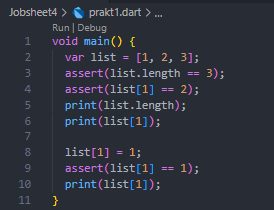

### Langkah 2:

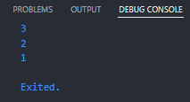

### Langkah 3:

## Praktikum 2

### Langkah 1:

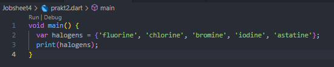

### Langkah 2:

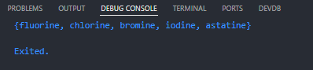

### Langkah 3:

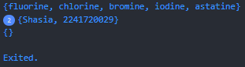

## Praktikum 3

### Langkah 1:

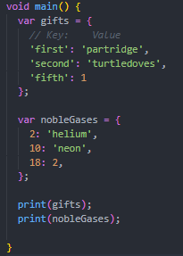

### Langkah 2:

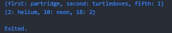

### Langkah 3:

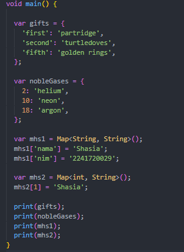

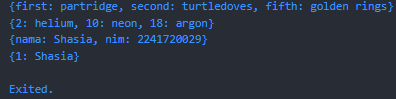

## Praktikum 4

### Langkah 1:

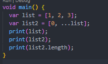

### Langkah 2:

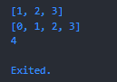

### Langkah 3:

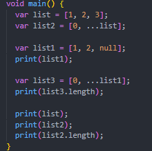
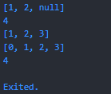

### Langkah 4:

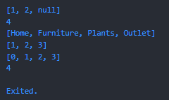

### Langkah 5:

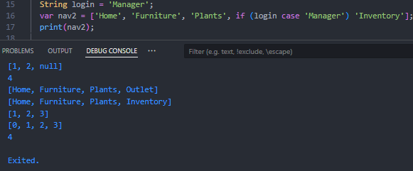

### Langkah 6:

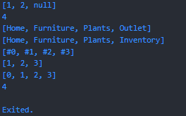

Collection for digunakan untuk membuat elemen didalam suatu koleksi seperti list, seat atau map menggunakan perulangan for secara langsung dalam deklrasai koleksi.

## Praktikum 5

### Langkah 1:

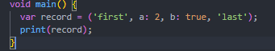

### Langkah 2:

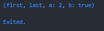

### Langkah 3:

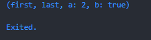

Tidak terjadi error dan outputnya sama dengan langkah 2

### Langkah 4:

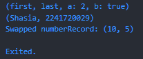

### Langkah 5:

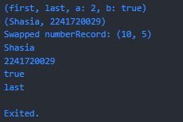

## Tugas Praktikum

1.  Silakan selesaikan Praktikum 1 sampai 5, lalu dokumentasikan berupa screenshot hasil pekerjaan Anda beserta penjelasannya!

2.  Jelaskan yang dimaksud Functions dalam bahasa Dart!

    Jawab: Function adalah sekumpulan kode yang dapat dieksekusi untuk melakukan tugas tertentu dengan struktur yang lebih terorganisir dan mudah dibaca.

3.  Jelaskan jenis-jenis parameter di Functions beserta contoh sintaksnya!

    Jawab:

    - Parameter Positional: Menggunakan urutan tertentu, diisi berdasarkan urutan saat pemanggilan.

            void greet(String name, int age) {
                print('Halo, $name! Anda berusia $age tahun.');
            }
            void main() {
                greet('Reva', 20);
            }

    - Parameter Named: Menggunakan nama saat pemanggilan.

            void greet({required String name, required int age}) {
                print('Halo, $name! Anda berusia $age tahun.');
            }
            void main() {
                greet(name: 'Dara', age: 25);
            }

    - Parameter Default: Memiliki nilai default jika tidak diisi saat pemanggilan.

            void greet(String name, {int age = 18}) {
                print('Halo, $name! Anda berusia $age tahun.');
            }
            void main() {
                greet('Yera');
            }

    - Parameter Opsional: Bisa berupa positional atau named.
      void greet(String name, [int? age]) {
      print('Halo, $name!');
      if (age != null) {
      print('Anda berusia $age tahun.');
      }
      }
      void main() {
      greet('Ars', 19);
      }

4.  Jelaskan maksud Functions sebagai first-class objects beserta contoh sintaknya!

    Jawab: Functions sebagai first-class objects yaitu fungsi diperlakukan sebagai objek yang dapat disimpan dalam variabel, diteruskan sebagai argumen, dan dikembalikan dari fungsi lain.

        void main() {
            int Function(int, int) tambah = (int a, int b) => a + b;
        var hasil = tambah(2, 3);
            print('Hasil: $hasil');
        }

5.  Apa itu Anonymous Functions? Jelaskan dan berikan contohnya!

    Jawab: Anonymous function adalah fungsi yang tidak memiliki nama, sering digunakan sebagai callback atau ketika fungsi sederhana diperlukan.

        void main() {
            var jumlah = (int a, int b) {
                return a + b;
            }
        }

6.  Jelaskan perbedaan Lexical scope dan Lexical closures! Berikan contohnya!

    Jawab:

    - Lexical scope ditentukan oleh struktur kode dan lokasi di mana variabel tersebut dideklarasikan.

            void main() {
                var luar = 'Luar';
                void dalam() {
                    var dalam = 'Dalam!';
                    print(luar);
                    print(dalam);
                }
            }

    - Lexical closures adalah fungsi yang memiliki akses ke variabel dari lingkupnya meskipun fungsi tersebut dieksekusi di luar lingkup asalnya.

            void main() {
                var counter = 0;
                Function buatCounter() {
                    return () {
                        counter++;
                        return counter;
                    };
                }
                var hitung = buatCounter();
                print(hitung()); // Output: 1
                print(hitung()); // Output: 2
            }

7.  Jelaskan dengan contoh cara membuat return multiple value di Functions!

    Jawab:

        Map<String, int> bagiDanSisa(int a, int b) {
            return {
                'hasilBagi': a ~/ b,
                'sisa': a % b,
            };
        }
        void main() {
            var hasil = bagiDanSisa(10, 3);
            print('Hasil bagi: ${hasil['hasilBagi']}, Sisa: ${hasil['sisa']}');
        }

8.  Kumpulkan berupa link commit repo GitHub pada tautan yang telah disediakan di grup Telegram!
