# flutter_plugin_pubdev

A new Flutter project.

## Getting Started

Nama: Shasia Sasa Salsabyla

Absen: 23

NIM: 2241720029

Kelas: TI 3H

## Tugas Praktikum

### 1. Hasil Praktikum

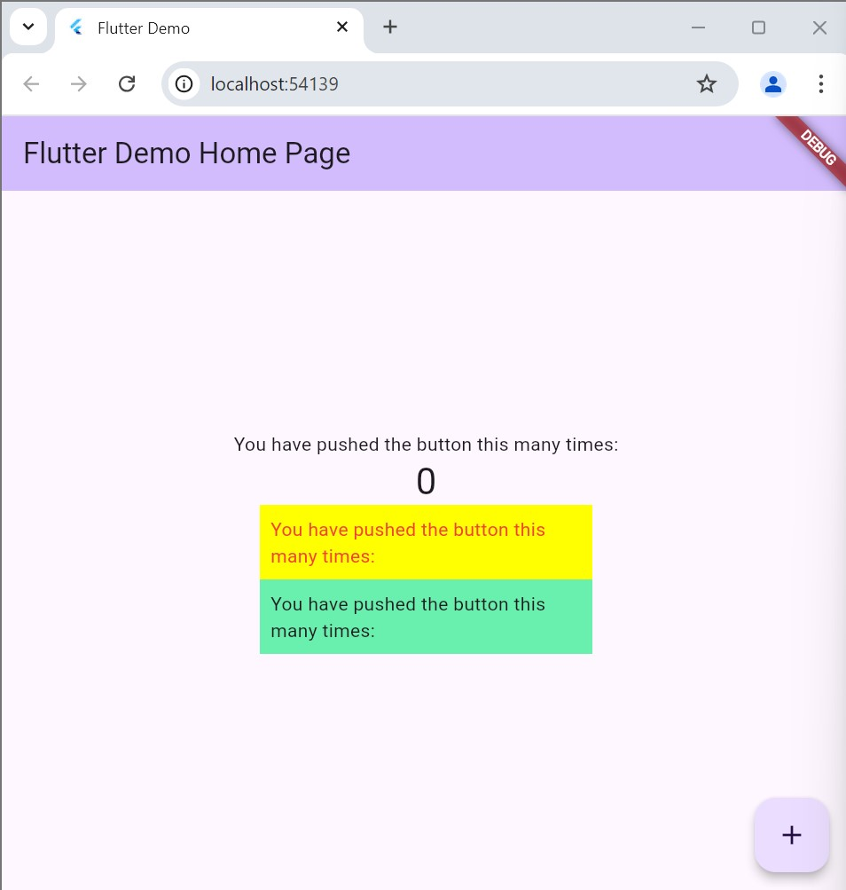

### 2. Jelaskan maksud dari langkah 2 pada praktikum tersebut!

Jawab:

Perintah flutter pub add auto_size_text adalah metode cepat dan praktis untuk menambahkan paket auto_size_text ke proyek Flutter Anda. Paket ini menyediakan widget yang memungkinkan teks otomatis menyesuaikan ukurannya agar sesuai dengan ruang yang tersedia.

### 3. Jelaskan maksud dari langkah 5 pada praktikum tersebut!

Jawab

Kode ini mendefinisikan konstruktor untuk kelas RedTextWidget, yang membutuhkan input teks (diberikan melalui parameter text). Dengan deklarasi final, nilai teks tidak dapat diubah setelah diinisialisasi, sementara kata kunci const memungkinkan objek ini digunakan dalam konteks yang membutuhkan konstanta, seperti dalam metode build yang teroptimasi.

### 4. Pada langkah 6 terdapat dua widget yang ditambahkan, jelaskan fungsi dan perbedaannya!

Jawab

1. Penyesuaian Ukuran Teks:

    - RedTextWidget memanfaatkan AutoSizeText (dari auto_size_text package), yang memungkinkan ukuran teks otomatis beradaptasi sesuai ruang yang tersedia, sehingga teks tidak terpotong.

    - Text adalah widget standar yang tidak otomatis menyesuaikan ukuran teks saat ruang terbatas, sehingga ada risiko pemotongan teks.

2. Lebar Container:

    - RedTextWidget ditempatkan dalam Container dengan lebar 50 piksel yang cukup kecil; meskipun begitu, AutoSizeText memungkinkan teks untuk mengecil sesuai ruang yang ada.

    - Text ditempatkan dalam Container berukuran 100 piksel, lebih luas daripada 50 piksel, namun tetap ada kemungkinan teks terpotong bila terlalu panjang.

3. Tampilan Visual:

    - Secara tampilan, teks dalam RedTextWidget terlihat lebih kecil, namun tetap utuh.

    - Teks dalam Text bisa tampak normal, tetapi dapat mengalami pemotongan atau overflow jika ruangnya terbatas.

### 5. Jelaskan maksud dari tiap parameter yang ada di dalam plugin auto_size_text berdasarkan tautan pada dokumentasi ini !

### auto_size_text package

- Usage

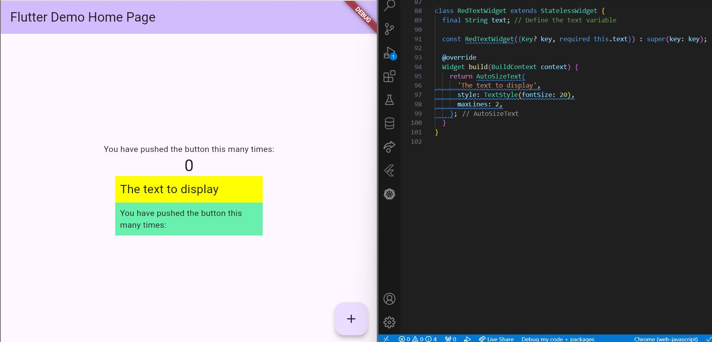

- maxLines

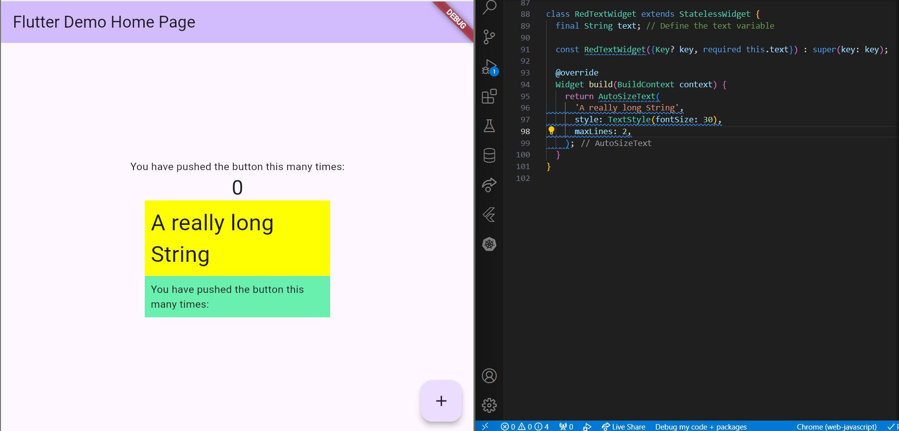

- minFontSize & maxFontSize

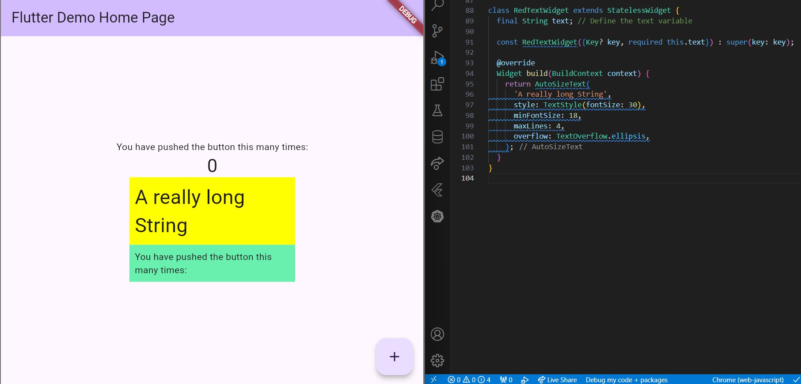

- Group

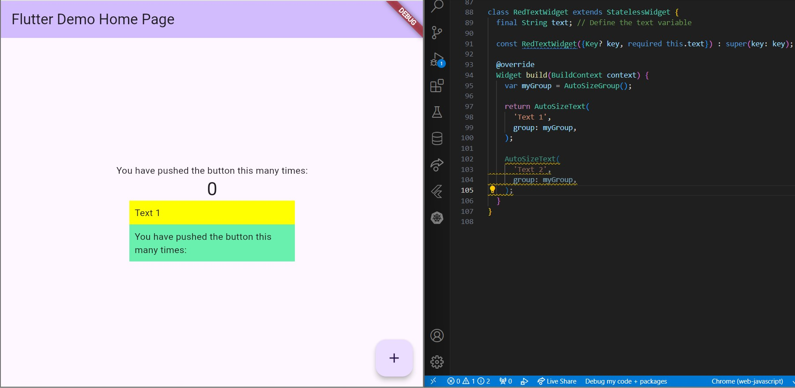

- stepGranularity

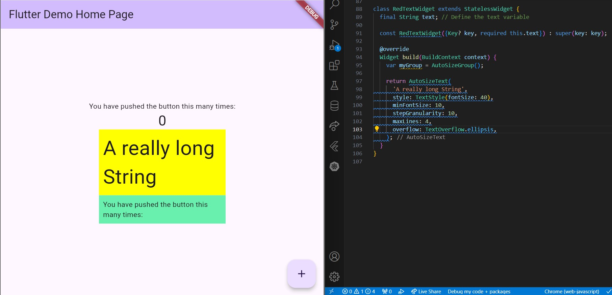

- presetFontSize

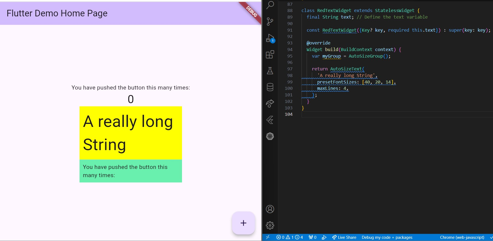

- overflowReplacement

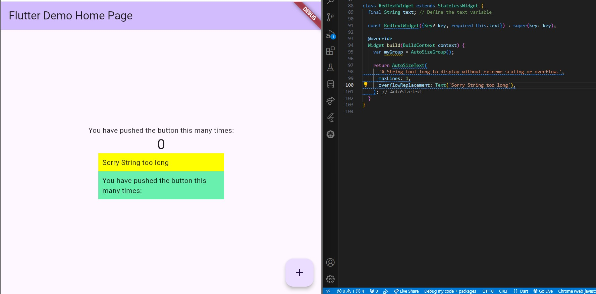

- Rich Text

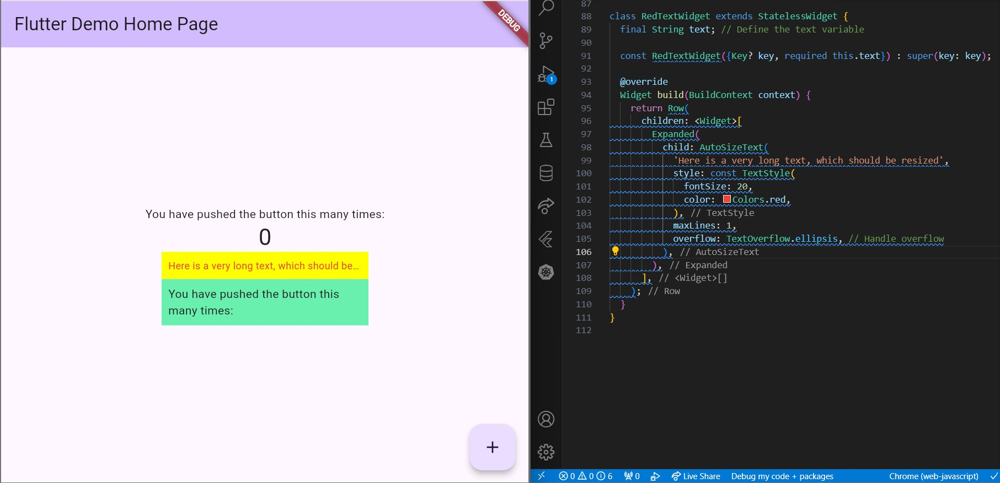

- Parameters

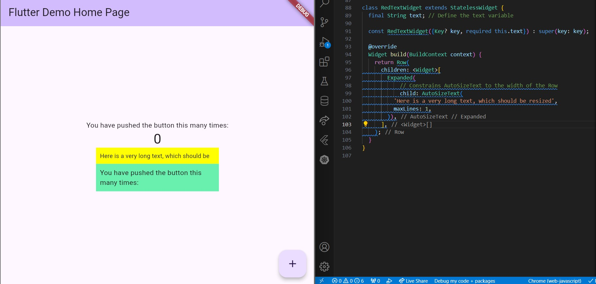

- Performance

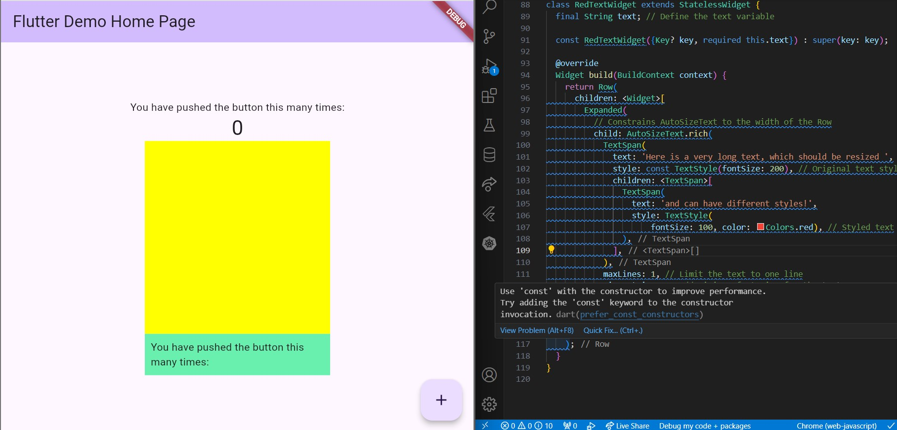

- Troubleshooting

### Missing bounds

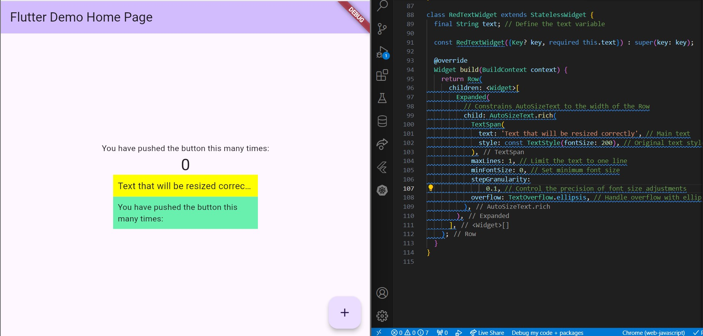

### MinFontSize too large

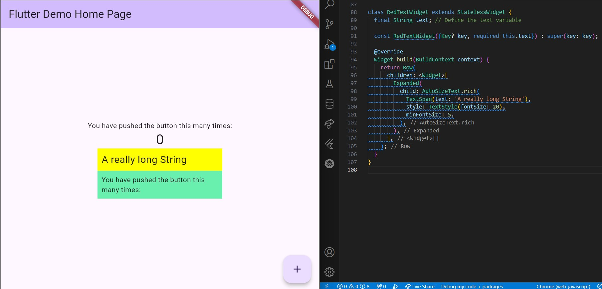

